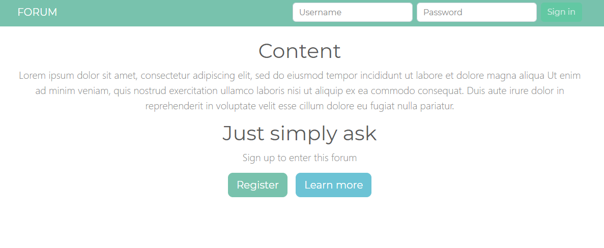
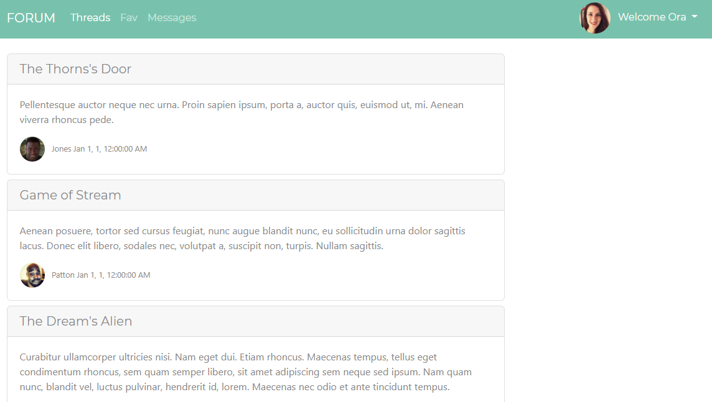
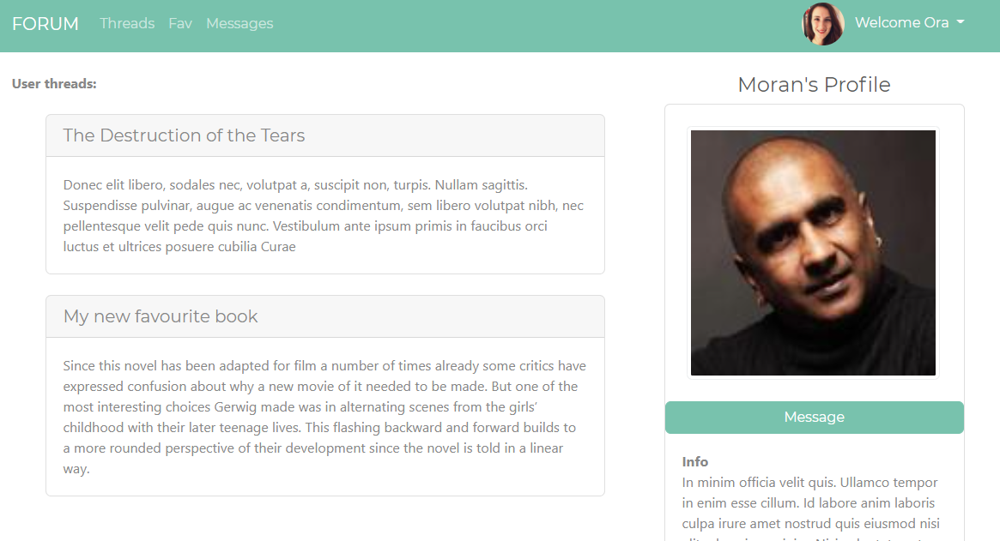

# Forum web API application
## About
The main goal of this project was to enable communication between the users. Each one can create their own thread which can be commented by other users.

## View
#### Login Page:

#### Home Page:

#### Profile Page:

## Technologies
- ASP.NET Core 3.1 for backend
- Angular 9 or frontend
- SQLite database (code-first approach in EntityFramework)
- JWT for authentication

## Software design pattern
- DTO
- Repository pattern

## Libraries
- Bootstrap
- Alertify js
- Automapper
